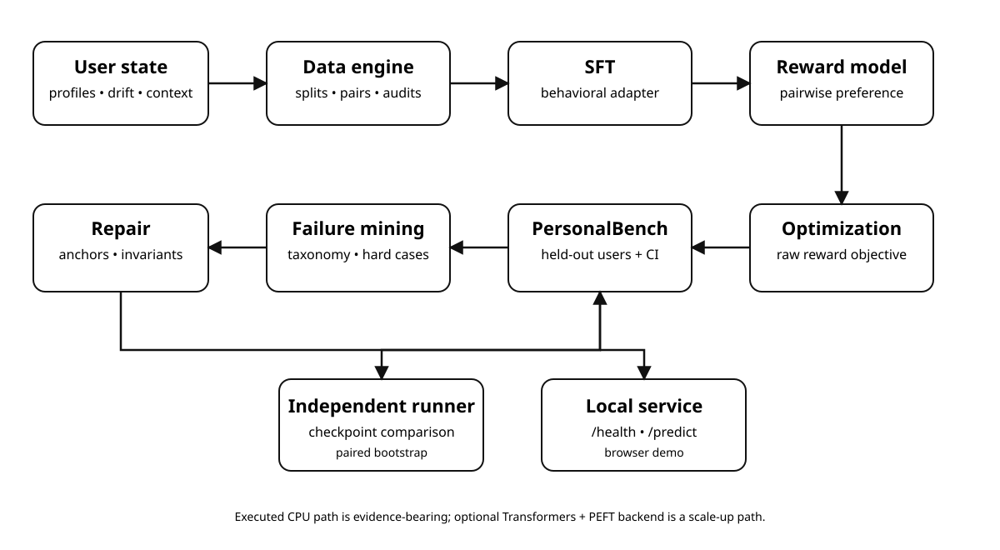

# Architecture

The project deliberately separates the **executed CPU research backend** from the **optional open-weight LLM scale-up backend**. Both consume the same benchmark/data contracts where practical, but only executed results are used for headline claims.



## Closed-loop research path

1. **Synthetic user state** generates preferences, preference drift, and contextual behavior targets.
2. **Dataset builder** creates user-held-out train/validation/test splits and preference pairs.
3. **SFT behavioral adapter** learns a supervised policy on the CPU reference backend.
4. **Reward model** learns pairwise preferences conditioned on user state.
5. **Reward optimization** produces a deliberately retained negative result: reward improves while benchmark behavior regresses.
6. **PersonalBench v3.1** evaluates personalization, factuality, non-sycophancy, and proactivity on unseen users.
7. **Failure mining** identifies concrete threshold violations and clusters the dominant failure modes.
8. **Constrained repair** adds supervised anchors and protected invariants, then re-runs evaluation.
9. **Serving and benchmark runners** expose checkpoints independently from the paper pipeline.

## Trust boundaries

- The local service binds to loopback by default and does not persist request bodies.
- Synthetic user data are research fixtures, not claims about real user populations.
- The optional LLM backend is a scale-up path; it is not presented as executed evidence in this release.
- Release audit, SBOM, hashes, cards, and claims/limitations documents are part of the reproducibility boundary.

## Primary executable paths

```text
make reproduce
  -> benchmark construction
  -> SFT
  -> reward model
  -> unconstrained optimization
  -> constrained repair
  -> held-out test evaluation
  -> statistics + failure reports

bounded-self-serve
  -> checkpoint loader
  -> local JSON inference API

bounded-self-benchmark
  -> checkpoint evaluation
  -> optional reference comparison
  -> paired bootstrap report
```
